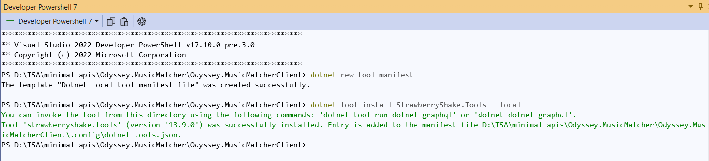

# Creating the .NET 8 GraphQL Client

## Add the Strawberry Shake CLI tools

> 1. Open your terminal and navigate to the directory where you want to create the project.
> 1. Run the following commands to create a dotnet tool-manifest and install the Strawberry Shake tools:

```powershell
dotnet new tool-manifest
dotnet tool install StrawberryShake.Tools --local
```



## Create a console project

> 1. Create a new solution and console application using the following commands:

```powershell
dotnet new sln -n Odyssey.MusicMatcher
dotnet new console -n Odyssey.MusicMatcherClient
dotnet sln add ./Odyssey.MusicMatcherClient
```

## Install the required packages

> 1. Add the StrawberryShake.Server package to your project to enable code generation:

```powershell
dotnet add Odyssey.MusicMatcherClient package StrawberryShake.Server
```

## Add a GraphQL client using the CLI tools

> 1. Run the following command to initialize a GraphQL client in your project.
> 1. This command initializes a GraphQL client named ConferenceClient in your project and configures it to connect to the specified GraphQL endpoint.
> 1. After running the command, Strawberry Shake CLI will generate the necessary C# classes for your GraphQL operations and types based on the provided endpoint and schema.
> 1. You can customize the namespace of the generated client by editing the .graphqlrc.json file.

```powershell
dotnet graphql init http://localhost:5266/graphql/ -n MusicMatcherClientSvc
```

Write a GraphQL query:

Create a new query document (e.g., GetSessions.graphql) in the ./Documents/Queries directory.
Define your GraphQL query in the document.
Compile your project:

Run dotnet build to compile your project and generate the necessary code.
Use the generated client in your code:

Update your Program.cs file to use the generated client.
Add code to execute the GraphQL query and handle the response.
Run the console application:

Start the console application using dotnet run --project ./Demo.
Following these steps will set up a console application with Strawberry Shake as a GraphQL client, allowing you to fetch data from your GraphQL backend. If you have any questions or encounter any issues while following these instructions, feel free to ask!
